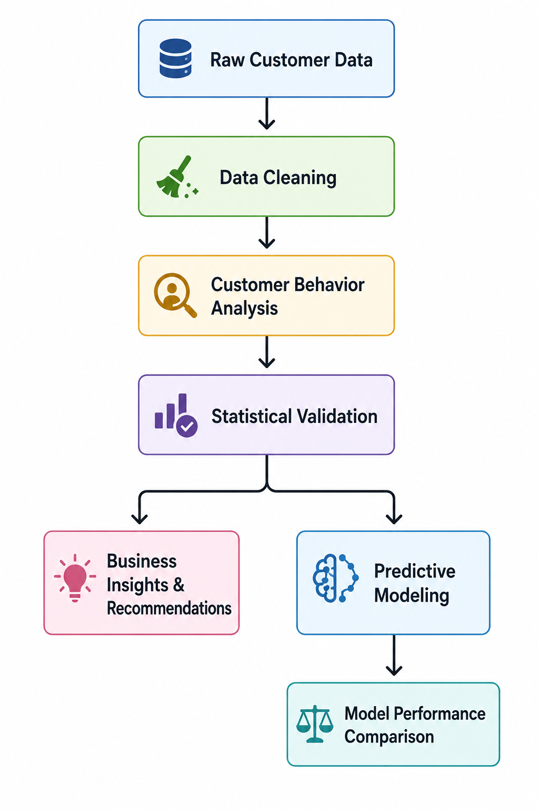
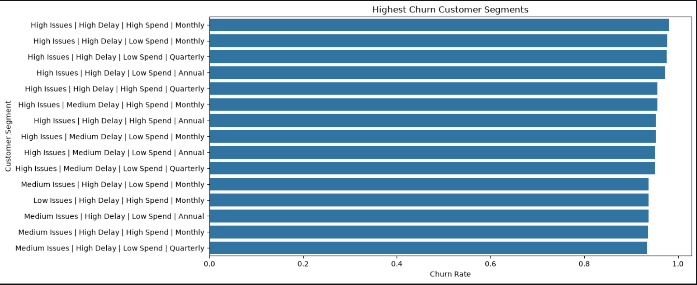

## Project Overview

Customer churn prediction is often approached as a machine learning problem, but selecting the most suitable model also depends on business priorities. This project follows an end-to-end data science workflow, beginning with SQL-based customer behavior analysis, followed by business-driven feature engineering, statistical validation, and predictive modeling. Instead of selecting a model based only on predictive performance, the models are evaluated based on their ability to balance the loss of high business-value customers against the cost of applying retention strategies to misclassified low business-value customers.

## Business Value Definition

For this analysis, customer business value is defined using multiple customer characteristics. **High business-value customers** are those with High Spend, Annual/Quarterly Contract Length, Premium/Standard Subscription Type, Medium/High Tenure, High Usage Frequency, and Low Last Interaction. Conversely, **low business-value customers** are characterized by Low Spend, Monthly Contract Length, Basic Subscription Type, Low/Very Low Tenure, Low Usage Frequency, and High Last Interaction.

## Why This Project?

Customer churn can significantly impact a company's revenue, especially when high business-value customers leave the platform. While machine learning models can predict churn, selecting the best model is not simply a matter of achieving the highest accuracy. Different prediction errors have different business consequences.

Missing a high business-value customer who is likely to churn can result in substantial revenue loss and the loss of a long-term customer relationship. On the other hand, incorrectly predicting churn for a low business-value customer may lead to unnecessary retention campaigns, increasing operational costs with limited business benefit.

This project focuses on evaluating machine learning models based on these business priorities, helping determine which model is most appropriate for different customer retention strategies rather than relying solely on predictive performance.

---

## Workflow Diagram

<p align="center">
  
</p>

## My approach
### Data cleaning
- Identified and handled missing values and noisy data to prepare a clean dataset for subsequent analysis and modeling.

📓 **Notebook:** [01_Data_cleaning.ipynb](Notebooks/01_Data_cleaning.ipynb)

### Customer Behavior Analysis

- Analyzed customer behavior using SQL to identify behavioral patterns associated with customer churn.
- Engineered business-driven features by identifying meaningful behavioral thresholds using churn-rate gaps, pattern stability, and group balance.
- Created business features such as **Issue Level**, **Delay Level**, and **Spend Level** to capture customer behavior in a more interpretable form.
- Identified the most influential features based on churn-rate differences and discovered high-risk customer segments through combinations of behavioral feature groups.
- Hypothesized two potential drivers of customer churn—**service frustration** (customer dissatisfaction with the service) and **financial constraints** (customers unable or unwilling to afford the service)—and investigated these hypotheses across high-risk customer segments.

- Validated the findings from SQL analysis through visual exploration to confirm customer behavior patterns and churn trends.

**Key Findings**

#### SQL Analysis results 

 *Important Features (Strong Association with Churn)*

| Rank | Feature | Key Finding | Churn Rate Gap | Customers (High-Risk Segment) |
|------|---------|-------------|----------------|-------------------------------|
| 1 | **Support Calls** | Churn jumps from ~0.29 (0-2 calls) to ~0.91 (5-10 calls) | ~62% | 183k |
| 2 | **Payment Delay** | Churn jumps from 0.47 (medium delay) to 0.94 (high delay) (21-30 delays) | ~47% | 111k |
| 3 | **Total Spend** | Churn drops sharply from 0.88 (low spend) to 0.41 (high spend) (100-508 spends) | ~47% | 151k |
| 4 | **Contract Length** | Monthly contracts have ~0.90 churn vs ~0.46 for annual/quarterly | ~44% | 109k |

---

*Less Important Features (Weak or Noisy Association)*

| Feature | Churn Rate Range | Why Not Important |
|---------|------------------|--------------------|
| **Last Interaction (LI)** | 0.49 → 0.63 | Only ~25% difference |
| **Usage Frequency** | 0.53 → 0.60 | Small gap, unclear pattern |
| **Tenure** | 0.50 → 0.60 | Very narrow range (~10%) |
| **Subscription Type** | 0.55 – 0.57 | Almost no difference |
| **Age** | Varies widely | No consistent pattern |
| **Gender** | Female 0.65 / Male 0.48 | Moderate but weaker than top features |


#### Visual Analysis

<p align="center">
  
</p>

<p align="center">
  <em>Figure 1. Highest Churn Customer Segments</em>
</p>

- The majority of the customers belongs to high value profile customers such High spend, Low/Medium Isuues, Low/Medium Delay and Annual/Quarterly contract length which gives stability to the platform.
- The top churning segments are Low Spend,Monthly Contract length,High/Medium Issues, and High/Medium Delay.
- The high spend segment also appears in top churning segment combination but it mainly driven by other segmanets. Though High spend customers churn with monthly contract length more than low spend 

📓 **Notebook:** [02_Customer_behavior_analysis.ipynb](Notebooks/02_Customer_behavior_analysis.ipynb)


### Statistical Validation

- Verified the association between each feature and customer churn using the **Chi-Square Test of Independence** and quantified the strength of association using **Cramér's V**.
- Interpreted **odds ratios** from Logistic Regression to identify customer segments with higher or lower odds of churning.
- Used **Cramér's V** to prioritize features based on their association strength with customer churn.
- Investigated the relationship between **Total Spend**, **Contract Length**, and behavioral features to explore the hypothesis that customers experiencing more service issues tend to delay payments. Odds ratios provided evidence of statistical association; however, due to the absence of time-series or longitudinal data, causal relationships could not be established.
- Verified that the key relationships observed through statistical analysis were also reflected in the splits and decision rules learned by the Decision Tree model.

#### Key Findings

- **Chi-Square Test of Independence** showed that all four engineered business features (**Issue Level**, **Delay Level**, **Spend Level**, and **Contract Length**) were statistically associated with customer churn (**p < 0.001**), rejecting the null hypothesis of independence.

- **Cramér's V** confirmed that these associations were strong, with values ranging from **0.367 to 0.549**, indicating that the observed relationships were meaningful and not merely a consequence of the large sample size.

- Based on **Cramér's V**, the engineered features were ranked by association strength as:
  1. **Issue Level** (0.549)
  2. **Spend Level** (0.432)
  3. **Delay Level** (0.416)
  4. **Contract Length** (0.367)

- **Logistic Regression Odds Ratios** identified the highest-risk customer segments:
  - **High Issue** customers had **17.5×** higher odds of churning than Low Issue customers.
  - **High Payment Delay** customers had **16×** higher odds of churning than Low Delay customers.
  - **Low Spend** customers had **7.7×** higher odds of churning than High Spend customers.
  - **Monthly Contract** customers had **7.3×** higher odds of churning than Annual Contract customers.

- Across all statistical analyses, the same high-risk customer segments were consistently identified: **High Issue**, **High Payment Delay**, **Low Spend**, and **Monthly Contract**.

- An additional association was observed between **High Payment Delay** and **High Issue** customers. While this suggests that customers experiencing more service issues may also delay payments, the available cross-sectional dataset does not support causal conclusions due to the absence of time-series data.

📓 **Notebook:** [03_Statistical_validation.ipynb](Notebooks/03_Statistical_validation.ipynb)

### Business Insights and Recommendations

- Developed separate retention strategies for different subgroups of **low business-value** and **high business-value** customers.
- For **low business-value customers**, those experiencing **High Issues** and **High Payment Delay** are prioritized for proactive outreach using **low-cost, scalable retention strategies**. Customers with **Monthly Contracts**, **Low Issues**, and **Medium/High Payment Delay** are targeted with initiatives that encourage greater long-term commitment and higher spending.
- For **high business-value customers**, those experiencing **High Issues** and **High Payment Delay** are prioritized for proactive outreach through **personalized retention strategies**. High business-value customers on **Monthly Contracts** are offered personalized engagement and long-term commitment programs to strengthen customer relationships and maximize customer lifetime value.

📄 **Report:** [04_Business_Insights_and_Recommendation.md](Notebooks/04_Business_Insights_and_Recommendation.md)

### Predictive Modeling

The predictive modeling stage followed a consistent workflow across all machine learning models to enable fair comparison of their predictive performance and business impact.

The workflow included:

1. Feature Engineering
   - Applied one-hot encoding to categorical variables.
   - Split the dataset into training and testing sets.
   - Scaled numerical features where required (Logistic Regression).

2. Model Training
   - Trained Logistic Regression, Decision Tree, Random Forest, and XGBoost models.
   - Optimized model hyperparameters using GridSearchCV and RandomizedSearchCV where appropriate.

3. Model Evaluation
   - Evaluated models using Accuracy, Precision, Recall, F1-Score, ROC-AUC, and Confusion Matrix.

4. Segment-wise Business Evaluation
   - Evaluated model performance across different customer segments to assess each model's ability to identify high-risk customers and support business-oriented retention strategies.
5. Logistic Regression

📓 **Notebook:** [05_Logistic_regression.ipynb](Notebooks/05_Logistic_regression.ipynb)


Built a baseline interpretable classification model.

- For example, The percentage missclassification of non-churning(False positive) result.

| Feature | Customer Segment | False Positives (%) |
|---------|------------------|--------------------:|
| **Contract Length** | Annual | 10.67% |
| | Monthly | 88.72% |
| | Quarterly | 10.54% |
| **Payment Delay** | High Delay | 100.00% |
| | Low Delay | 12.58% |
| | Medium Delay | 9.03% |
| **Issue Level** | High Issues | 100.00% |
| | Low Issues | 6.02% |
| | Medium Issues | 10.09% |
| **Spend Level** | High Spend | 7.03% |
| | Low Spend | 100.00% |

- Applying the retention stratergies on missed non-churning low spend,monthly contract length low value profile customers can lead to a buisness loss.

- The model appears to rely heavily on strong churn indicators such as high payment delays or frequent support issues. Customers who churned without exhibiting these dominant patterns were more likely to be misclassified as non-churn.

6. Tree-Based Models (Business Features)

📓 **Notebook:** [06_Tree_based_models_4_feature.ipynb](Notebooks/06_Tree_based_models_4_feature.ipynb)

Trained Decision Tree, Random Forest, and XGBoost models using the engineered business features and compared their predictive performance.


7. Tree-Based Models (All Features)

📓 **Notebook:** [07_Tree_based_models_with_all_features.ipynb](Notebooks/07_Tree_based_models_with_all_features.ipynb)

Evaluated tree-based models using the complete feature set and compared their performance with the business-feature models to assess the impact of additional customer attributes. The XG Boost model was interpreted using SHAP

### Model Performance Comparison

- Compared all models to identify the one that best balances business objectives by minimizing the misclassification of **high business-value customers who are likely to churn** while reducing unnecessary retention efforts for **low business-value customers**.

- Evaluated the models using both traditional classification metrics, including **Accuracy, Precision, Recall, F1-Score, and ROC-AUC**, and business-oriented metrics that measure the percentage of **high business-value** and **low business-value** customers incorrectly classified.

- Recommended the most appropriate model based on the business objective, distinguishing between scenarios where minimizing **false negatives** (missing customers who are likely to churn) is more important and scenarios where minimizing **false positives** (incorrectly predicting churn for customers who would not churn) is the priority.


**Key Findings**

| Model | Features Used | Accuracy | Precision | Recall | F1-Score | ROC-AUC | False Positives (FP) | False Negatives (FN) |
|:------|:--------------|---------:|----------:|-------:|---------:|--------:|---------------------:|---------------------:|
| Logistic Regression | 4 | **88.52%** | 88.76% | 90.81% | 89.78% | 91.96% | 6,449 | 5,155 |
| Decision Tree | 4 | **89.67%** | 88.67% | 93.33% | 90.94% | 92.32% | 6,692 | 3,742 |
| Random Forest | 4 | **89.67%** | 88.67% | 93.33% | 90.94% | 92.34% | 6,692 | 3,742 |
| XGBoost | 4 | **89.67%** | 88.67% | 93.33% | 90.94% | 92.34% | 6,692 | 3,742 |
| Random Forest | All Features | **91.56%** | 88.58% | 97.35% | 92.76% | 94.29% | 7,039 | 1,484 |
| XGBoost | All Features | **91.59%** | 88.58% | 97.42% | 92.79% | 94.42% | 7,049 | **1,448** |


- **Logistic Regression** achieved the highest precision and the lowest false positive rate, making it the preferred model when minimizing unnecessary retention efforts is the primary business objective.
- **Tree-based models** outperformed Logistic Regression in **Accuracy**, **Recall**, and **ROC-AUC** by capturing complex non-linear relationships and reducing false negatives across key customer segments.
- Using all available features further improved performance, with **Random Forest** and **XGBoost** significantly outperforming the models trained on only the four engineered features.
- **XGBoost** achieved the best overall predictive performance, delivering the highest Accuracy, Recall, and ROC-AUC among all evaluated models.
- For customer retention, **XGBoost** is recommended because it minimizes missed churning customers while maintaining strong overall predictive performance. However, **Logistic Regression** is a better choice when reducing false positives and unnecessary retention costs is the primary concern.

📄 **Report:** [08_Model_performace_Comparison.md](Notebooks/08_Model_performace_Comparison.md)

---

## Repository Structure

```text
CHURN-ANALYSIS-FROM-SQL-TO-ML
│
├── Data
│   ├── Raw/                          # Original datasets
│   └── Cleaned/                      # Preprocessed dataset
│
├── Images/                           # README figures and workflow diagrams
│
├── Models/                           # Trained ML models (.pkl/.joblib)
│
├── Notebooks/
│   ├── 01_Data_cleaning.ipynb
│   ├── 02_Customer_behavior_analysis.ipynb
│   ├── 03_Statistical_validation.ipynb
│   ├── 04_Business_Insights_and_Recommendation.md
│   ├── 05_Logistic_regression.ipynb
│   ├── 06_Tree_based_models_4_feature.ipynb
│   ├── 07_Tree_based_models_with_all_features.ipynb
│   ├── 08_Model_Performance_Comparison.md
│   
│
├── app/                              # FastAPI application (future deployment)
│
├── README.md                         # Project documentation
├── requirements.txt                  # Python dependencies
├── Dockerfile                        # Containerization (planned)
├── .gitignore
└── LICENSE
```

## Technologies Used

| Category | Technologies |
|----------|--------------|
| **Programming Languages** | Python, SQL |
| **Data Manipulation** | Pandas, NumPy |
| **SQL Analysis** | SQLAlchemy |
| **Data Visualization** | Matplotlib, Seaborn |
| **Machine Learning** | Scikit-learn, XGBoost |
| **Statistical Analysis** | Chi-Square Test, Cramér's V, Logistic Regression Odds Ratios |
| **Model Interpretation** | SHAP |
| **Development Tools** | Jupyter Notebook, VS Code, Git, GitHub |
| **Deployment (Planned)** | FastAPI, Docker |

## Future Improvements

- Deploy the churn prediction model as a **FastAPI** REST API for real-time customer churn prediction.
- Containerize the application using **Docker** to simplify deployment and improve portability.
- Integrate the model with a relational database to automate data ingestion and prediction workflows.
- Implement **cost-sensitive learning** to optimize the trade-off between false negatives and false positives based on business objectives.
- Explore advanced ensemble techniques and hyperparameter optimization to further improve predictive performance.
- Extend the analysis using **time-series customer behavior** to better understand how customer actions evolve before churn.
- Develop an interactive dashboard for visualizing churn predictions and business insights.