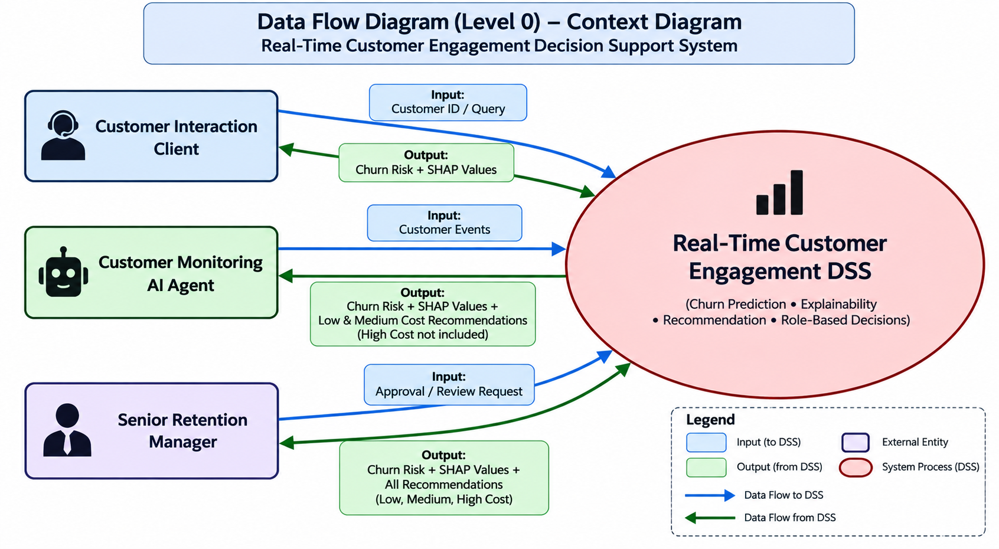
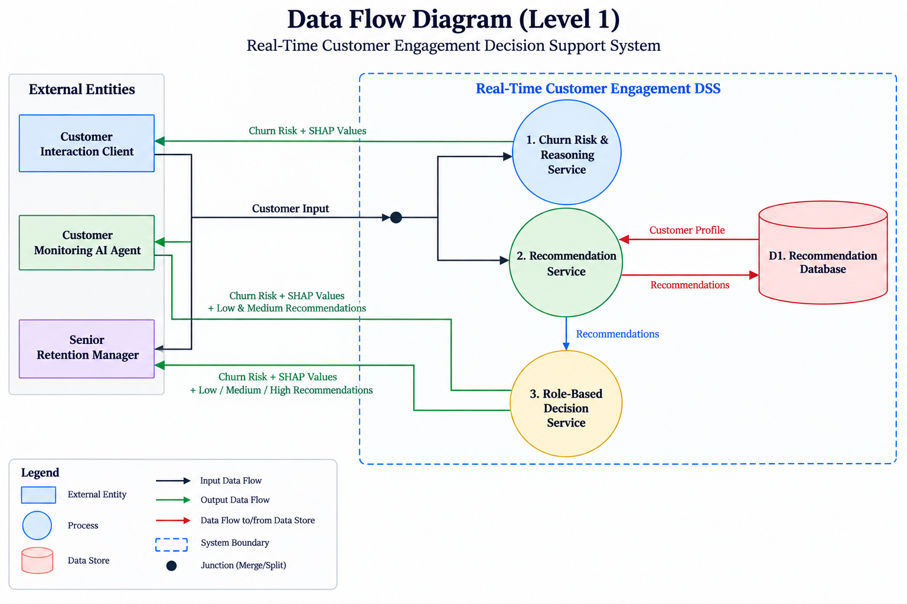

# Real-Time Customer Engagement Decision Support System

An AI-powered Decision Support System (DSS) that assists support staff and autonomous AI agents in making real-time customer engagement decisions. The system predicts customer churn risk, explains the reasons behind each prediction using explainable AI, and recommends personalized engagement strategies to improve customer experience and retention during live interactions.

## Problem Statement

Customer engagement decisions are made across both human-operated support systems and automated customer engagement workflows. During live customer interactions, these systems need timely customer intelligence to understand behavior, identify churn risk, and determine the most appropriate engagement strategy before the interaction ends.

Support staff require decision support while interacting with customers, whereas AI agents and automation workflows require a reliable API that can provide the same intelligence programmatically for real-time customer engagement tasks such as proactive outreach, prioritization, or personalized responses.

Offline or batch-oriented analytics generate insights after data processing is complete, making them unsuitable for scenarios where engagement decisions must be made immediately. Live customer engagement instead requires a real-time Decision Support System capable of returning predictions, explanations, and engagement recommendations on demand.

## Users and User Requirement

The Real-Time Customer Engagement Decision Support System is consumed by three different clients, each with a different responsibility in the customer engagement workflow.

### 1. Customer Interaction Client

**Who:** Human CRM agents, chatbots, voice bots, email responders, or any client responsible for engaging with customers through calls, chat, email, social media, or support tickets.

**Job:** Provide customer support by using customer intelligence from the Decision Support System before interacting with a customer.

**Requirements:**

1. The client needs to know the customer's churn risk and the reasons behind that risk before starting an interaction so they can choose the most appropriate approach for the conversation.

2. The client needs a quick response from the system because customer interactions often begin immediately, such as answering an incoming phone call or responding to a new support request.

3. The client needs the system to remain available even when many customers contact support simultaneously, so multiple customer requests can be handled without delays.

### 2. Customer Monitoring AI Agent

**Who:** A background AI agent.

**Job:** Continuously monitor customer events and behaviour independently of customer interactions, identify customers who require proactive engagement, and automate retention actions whenever appropriate.

**Requirements:**

1. The AI agent needs to continuously monitor customer events and evaluate every customer without waiting for a customer interaction to begin.

2. The AI agent needs to identify customers who are at risk of churn and understand the reasons behind that prediction before taking any action.

3. The AI agent needs to automatically execute low-cost and medium-cost engagement recommendations before a customer's churn risk increases, enabling proactive customer engagement.

4. The AI agent needs to escalate customers requiring high-cost retention actions to a Retention Manager instead of executing those actions itself.

5. The AI agent needs the system to remain available across all services because it monitors every customer continuously, and customer events may arrive in bursts.

6. The AI agent needs a fast response from the system so that engagement recommendations can be automated before a customer's churn risk increases.

---

### 3. Senior Retention Manager

**Who:** Senior CRM users responsible for retention decisions and high-value customer engagement.

**Job:** Review escalated customers and approve expensive retention actions.

**Requirements:**

1. The manager needs to review customers who have been escalated by the Customer Monitoring AI Agent.

2. The manager needs to understand the customer's churn risk and the reasons behind that prediction before approving any retention action.

3. The manager needs complete customer context, including relevant customer history and behaviour, to make informed retention decisions.

4. The manager needs access to all engagement recommendations, including low-, medium-, and high-cost actions, because they are responsible for approving expensive retention strategies.

5. The manager needs the system to respond quickly so escalated customers can be reviewed and retention decisions can be made without unnecessary delays.

6. The manager needs the system to remain available even during periods of high customer volume, ensuring escalated cases can always be reviewed.

## System Requirements

The system requirements are derived from the requirements of the Customer Interaction Client, Customer Monitoring AI Agent, and Senior Retention Manager. They define the capabilities and quality attributes that the Decision Support System must provide to support real-time customer engagement workflows.

### Functional Requirements

1. The system must predict customer churn risk for any customer whenever requested by a client.

2. The system must generate explainable reasons for every churn prediction so that clients understand why the customer is considered at risk.

3. The system must identify whether a customer is a High Business Value customer or a Low Business Value customer and provide that information to support customer engagement and retention decisions.

4. The system must generate engagement recommendations categorized into Low-, Medium-, and High-cost actions.

5. The system must enforce role-based decision actions, ensuring each client receives only the information and recommendations appropriate for its responsibility.

6. The system must support escalation of customers from the Customer Monitoring AI Agent to the Senior Retention Manager whenever a High-cost retention action is required.

### Non-Functional Requirements

1. The system must provide low response time so customer support clients and AI agents receive customer intelligence before engagement decisions are made.

2. The system must maintain high availability so it remains operational during peak customer traffic and bursts of customer events.

3. The system must support concurrent requests from multiple CRM clients and AI agents without degrading performance.

4. The system must be scalable to handle increasing numbers of customers, interactions, and monitoring events.

5. The system must be reliable so predictions, explanations, and recommendations are consistently available across customer engagement workflows.

6. The system must provide secure, role-based access to decision intelligence and decision actions for different clients.

## High-Level Design

The High-Level Design (HLD) describes the overall structure of the **Real-Time Customer Engagement Decision Support System (DSS)**. It defines the system boundary, external environment, system inputs and outputs, and the flow of information between external clients and the DSS before discussing the internal implementation.

---

### 1. System Boundary

The **Real-Time Customer Engagement Decision Support System (DSS)** is the central decision intelligence platform responsible for processing customer information and generating customer engagement intelligence and decision actions.

The system boundary separates the internal Decision Support System from all external entities that interact with it. Any client sending data to the DSS or consuming outputs from the DSS is considered part of the external environment.

---

### 2. External Environment

The external environment consists of all entities that interact with the Decision Support System but are not part of its internal implementation.

| External Entity | Role |
|-----------------|------|
| **Customer Interaction Client** | Uses customer intelligence before interacting with customers through calls, chat, email, social media, or support tickets. |
| **Customer Monitoring AI Agent** | Continuously monitors customer behaviour and automates proactive customer engagement. |
| **Senior Retention Manager** | Reviews escalated customers and approves high-cost retention actions. |

---

### 3. System Inputs

The Decision Support System receives different types of inputs depending on the client interacting with it.

| Source | Input to DSS |
|--------|--------------|
| **Customer Interaction Client** | Customer ID / Customer Query |
| **Customer Monitoring AI Agent** | Customer Events |
| **Senior Retention Manager** | Approval / Review Request |

---

### 4. System Outputs

The Decision Support System returns role-specific decision intelligence and decision actions to different clients.

| Destination | Output from DSS |
|-------------|-----------------|
| **Customer Interaction Client** | Churn Risk Prediction and SHAP Values |
| **Customer Monitoring AI Agent** | Churn Risk Prediction, SHAP Values, Low-Cost Recommendations, and Medium-Cost Recommendations |
| **Senior Retention Manager** | Churn Risk Prediction, SHAP Values, and All Recommendations (Low, Medium, and High Cost) |

---

### 5. Data Flow Diagram — Level 0 (Context Diagram)

The Level 0 Data Flow Diagram represents the Decision Support System as a single logical process. It shows the information exchanged between the DSS and the external entities without exposing the internal processing logic.

*Figure 1. Data Flow Diagram (Level 0): Context Diagram of the Real-Time Customer Engagement Decision Support System.*

---

### 6. Context Diagram Description

The **Customer Interaction Client** sends a customer identifier or customer query to the DSS and receives the customer's churn risk prediction and SHAP explanation before customer engagement.

The **Customer Monitoring AI Agent** continuously sends customer events to the DSS. In return, it receives churn predictions, SHAP explanations, and low- and medium-cost engagement recommendations to automate proactive customer engagement.

The **Senior Retention Manager** receives complete customer intelligence along with all engagement recommendations for escalated customers. The manager reviews the recommendations and sends approval or review decisions for high-cost retention actions back to the DSS.

### 2. Data Flow Diagram — Level 1 (Business Data Flow)

The Level 1 Data Flow Diagram decomposes the **Real-Time Customer Engagement Decision Support System (DSS)** into its three major business services. It illustrates how a customer request is processed inside the DSS to generate churn predictions, explainable reasoning, engagement recommendations, and role-specific decision outputs.

#### DFD Level 1

*Figure 2. Data Flow Diagram (Level 1): Business data flow inside the Real-Time Customer Engagement Decision Support System.*

---

#### Internal Processes

| Process | Responsibility |
|---------|----------------|
| **P1. Churn Risk & Reasoning Service** | Predicts customer churn risk and generates SHAP-based explanations for the prediction. |
| **P2. Recommendation Service** | Generates customer engagement recommendations using customer profile information from the recommendation database. |
| **P3. Role-Based Decision Service** | Filters recommendations based on the requesting client and returns role-specific decision actions. |

---

#### Data Store

| Data Store | Description |
|------------|-------------|
| **D1. Recommendation Database** | Stores customer profile information and generated engagement recommendations used by the Recommendation Service. |

---

#### Level 1 Data Flow Description

The three external clients send customer information to the Decision Support System through a common **Customer Input** flow. Inside the DSS, the customer input is distributed to the **Churn Risk & Reasoning Service** and the **Recommendation Service**.

The **Churn Risk & Reasoning Service** independently processes customer input and returns **Churn Risk Prediction** and **SHAP Values**.

The **Recommendation Service** retrieves the required **Customer Profile** from the **Recommendation Database** and generates customer engagement recommendations. The generated recommendations are passed to the **Role-Based Decision Service**, which filters recommendation levels according to the client's role.

The final outputs returned by the DSS are:

- **Customer Interaction Client:** Churn Risk Prediction and SHAP Values.
- **Customer Monitoring AI Agent:** Churn Risk Prediction, SHAP Values, Low-Cost Recommendations, and Medium-Cost Recommendations.
- **Senior Retention Manager:** Churn Risk Prediction, SHAP Values, and all Low-, Medium-, and High-Cost Recommendations.

## Technology Choice 

### Frontend Choice

**Possible Options**

- **Streamlit** *(Selected)*
- HTML, CSS, and JavaScript (Traditional Web Frontend)

**Selected Technology:** **Streamlit**

Streamlit was selected because it satisfies the functional requirements of the Decision Support System while providing native Python integration, lower operational overhead, and faster development for a real-time decision-support dashboard prototype.

**Evaluation Factors**

- Functional Requirement Support
- Python Integration
- Operational Overhead
- Development Effort
- Authentication Support
- Long-Term Flexibility

> **Technology Decision:** Streamlit was selected based on the first four evaluation factors. HTML/CSS/JavaScript offers stronger authentication support and greater long-term flexibility for production-scale applications.

**Detailed Comparison:** [`Technology_Choices/01_Frontend_Choice.md`](Technology_Choices/01_Frontend_Choice.md#frontend-choice)

### Backend Choice

**Possible Options**

- **FastAPI** *(Selected)*
- Flask
- Django

**Selected Technology:** **FastAPI**

FastAPI was selected because it satisfies the functional requirements of the Decision Support System while providing seamless machine learning integration, low-latency API responses, native concurrent request handling, scalability across multiple client types, and straightforward implementation of role-based security.

**Evaluation Factors**

- Functional Requirement Support
- Machine Learning Integration
- Low Latency
- Concurrent Request Handling
- Scalability Across Multiple Clients
- Role-Based Security

> **Technology Decision:** FastAPI was selected because it satisfied all functional requirements and provided the best overall fit for a real-time, machine learning-driven Decision Support System serving multiple client types through a common API interface.

**Detailed Comparison:** [`Technology_Choices/02_Backend_Choice.md`](Technology_Choices/02_Backend_Choice.md#backend-choice)

### Database Choice

**Possible Options**

- **MariaDB** *(Selected)*
- MySQL
- PostgreSQL

**Selected Technology:** **MariaDB**

MariaDB was selected because it satisfies the functional requirements of the Decision Support System while providing an efficient relational database for customer profiles, recommendation rules, and recommendation actions with low operational overhead for this project's deployment environment.

**Evaluation Factors**

- Functional Requirement Support
- Query Performance
- Operational Overhead

> **Technology Decision:** MariaDB was selected because all three databases satisfy the functional requirements and provide sufficient query performance for the current workload. MariaDB and MySQL were equally suitable choices, while PostgreSQL introduced additional operational complexity that was unnecessary for the current scope of the Decision Support System. MariaDB was chosen due to team familiarity and simpler development setup on Linux.

**Detailed Comparison:** [`Technology_Choices/03_Database_Choice.md`](Technology_Choices/03_Database_Choice.md#database-choice)

## Data Science Pipeline Choice

Unlike a traditional churn prediction project that directly trains a machine learning model, this project follows a **business-first data science pipeline**. Every stage of the workflow was designed to convert raw customer data into business decisions that support real-time customer retention.

The pipeline was evaluated by choosing appropriate analytical methods for each stage of the customer churn problem instead of relying on a single machine learning technique.

### Selected Data Science Pipeline

| Pipeline Stage | Selected Method |
|----------------|-----------------|
| **Data Cleaning** | Missing value handling and noisy data preprocessing. |
| **Customer Behavior Analysis** | SQL-based behavioral segmentation and churn pattern discovery. |
| **Feature Engineering** | Business-driven engineered features (Issue Level, Delay Level, Spend Level, Contract Length). |
| **Statistical Validation** | Chi-Square Test, Cramér's V, and Logistic Regression Odds Ratios. |
| **Predictive Modeling** | Logistic Regression, Decision Tree, Random Forest, and XGBoost. |
| **Model Explainability** | SHAP (SHapley Additive Explanations). |
| **Business-Oriented Model Evaluation** | Segment-wise evaluation using customer business value, false positives, and false negatives. |

### Why This Pipeline Was Chosen

The pipeline was designed around the following data science objectives:

- **Understand customer behavior before modeling** using SQL analysis rather than treating feature engineering as a purely machine learning step.
- **Engineer interpretable business features** from customer behavior instead of relying only on raw numerical variables.
- **Validate feature importance statistically** before training predictive models.
- **Compare multiple machine learning models** using both predictive metrics and business-oriented evaluation criteria.
- **Explain every prediction** using SHAP so CRM agents and retention managers understand *why* a customer is predicted to churn.
- **Support business decision-making** by balancing churn prediction performance with retention cost and customer business value.

> **Pipeline Decision:** A business-first data science pipeline was selected to transform customer behavior into explainable churn predictions and actionable retention recommendations, making the model suitable for a real-time Decision Support System instead of a standalone prediction model.

**Detailed Pipeline & Methodology:** [`Technology_Choices/04_Data_Science_pipeline.md`](Technology_Choices/04_Data_Science_pipeline.md)

## Cloud Platform Choice

**Possible Options**

- **Google Cloud Run** *(Selected)*
- Render
- AWS

**Selected Technology:** **Google Cloud Run**

Google Cloud Run was selected because it satisfies the deployment requirements of the Decision Support System while providing low latency for Indian users, built-in high availability, automatic horizontal scaling, and low operational overhead for a containerized FastAPI application.

**Evaluation Factors**

- Functional Requirement Support
- Low Latency
- High Availability
- Horizontal Scalability
- Operational Overhead

> **Technology Decision:** Google Cloud Run was selected because it provides the required production capabilities with minimal infrastructure management. Render offers simpler hosting but fewer regional and scaling options, while AWS provides similar capabilities with greater operational complexity for the current project scope.

**Detailed Comparison:** [`Technology_Choices/05_Cloud_Service_Choice.md`](Technology_Choices/05_Cloud_Service_Choice.md#cloud-platform-choice)

## Architecture Choice

**Possible Options**

- **Monolithic Architecture** *(Selected)*
- Microservices Architecture

**Selected Architecture:** **Monolithic Architecture**

A monolithic architecture was selected because it satisfies the functional requirements of the Decision Support System while providing lower inter-service communication latency, sufficient scalability for the current request workflow, lower operational overhead, and simpler deployment and maintenance for a single FastAPI application.

**Evaluation Factors**

- Functional Requirement Support
- Inter-Service Communication Latency
- Independent Scalability
- Operational Overhead
- Failure Isolation

> **Technology Decision:** Monolithic architecture was selected because every customer request currently follows the same processing pipeline through the ML Prediction, SHAP, and Recommendation services, making a single deployment unit the simplest and most efficient design. Microservices provide better failure isolation and independent scaling, but those advantages are not required for the current scope of the Decision Support System.

**Detailed Comparison:** [`Technology_Choices/06_Architecture_Choice.md`](Technology_Choices/06_Architecture_Choice.md#architecture-choice)